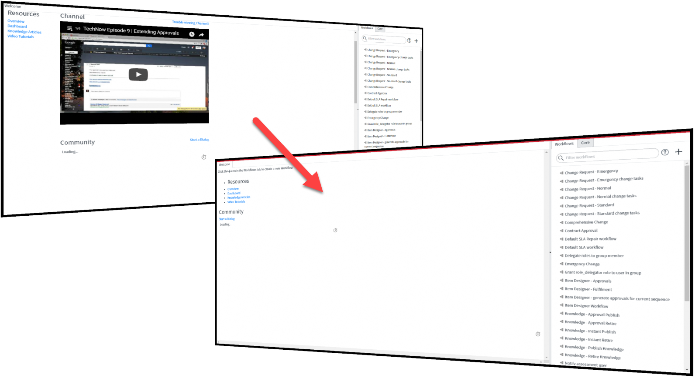

# Lightweight Workflow Homepage
Cleanup the workflow IDE homepage to help it load faster.

### About

This is a simple update set that removes the Youtube video and live feeds from the
workflow IDE in ServiceNow.

It renames the original file in order to keep a backup and adds a new UI Page.

### Install

Install the update set located in the [Packages](packages) folder.

### Compatibility

Extensive testing has not been undertaken but it should work for ServiceNow Geneva and greater.
